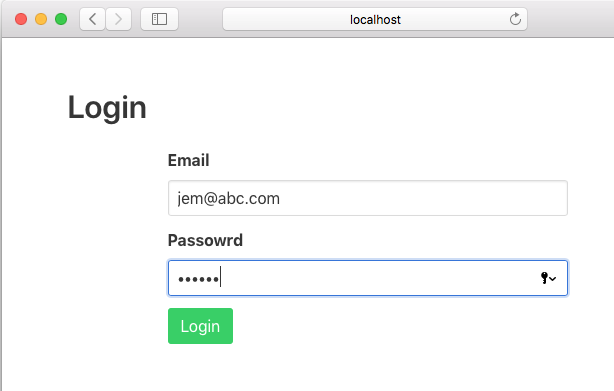
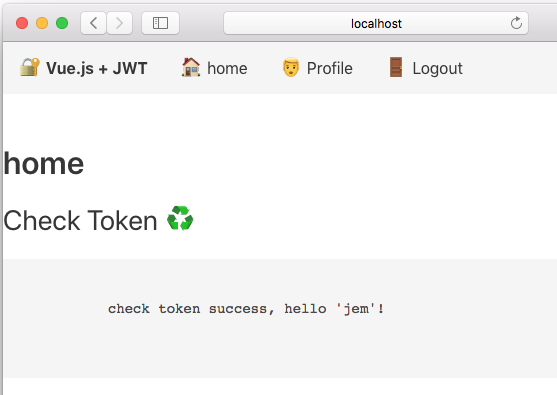
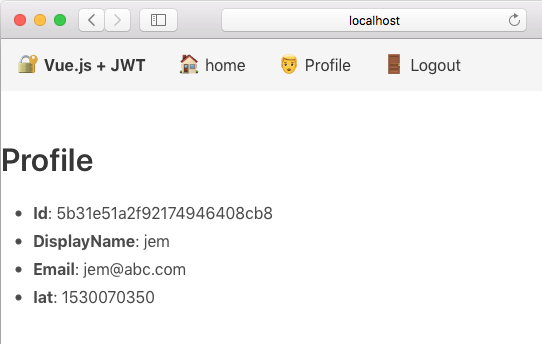

# jwt-demo
frontend:  demo-auth-jwt-vue， server: JWT_KOA_auth

## keywords
jwt, vue, KOA, auth, cors, javascript, login, auth

## 概要
我将github上的两个独立工程：demo-auth-jwt-vue与JWT_KOA_auth调试组合在了一起，
作为jwt-demo的前端与后端服务。通信接口修改，后端增加了cors跨域模块引用。

## 服务端，三个API
- /login (登录：下发token)
- /custom (验证token，返回用户信息)
- /user (注册：前端没有界面，需要使用postman在mongodb数据库先增加一个用户数据)

## 前端，
- 登录界面，调用/login
- 主页：展示token验证的信息，调用/custom
- 登录退出：清空本地token存储
- proflie：展示登录用户信息

## 截图

